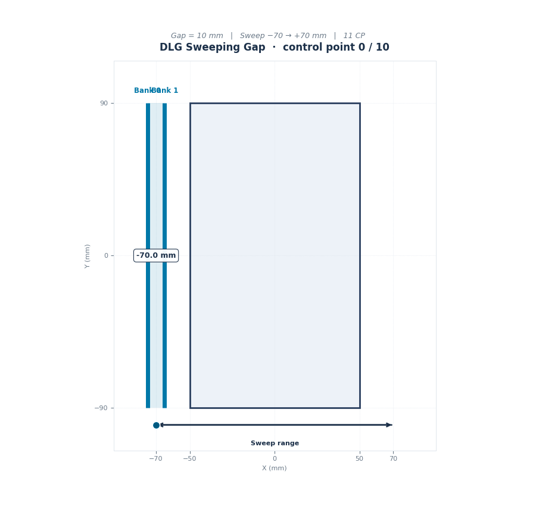
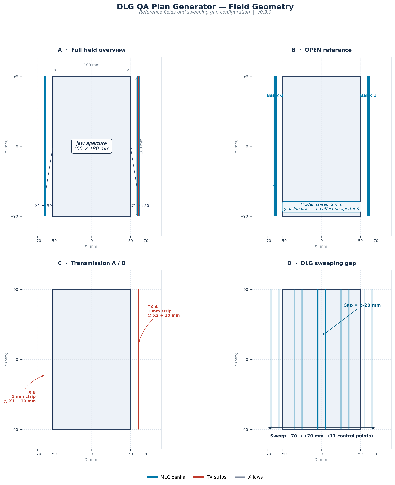

# DLG QA Plan Generator

Automated DLG QA plan generation for Varian Eclipse via ESAPI 16.1.

## Overview

DLG QA Plan Generator is an ESAPI script that automatically creates a complete Dosimetric Leaf Gap QA plan inside Varian Eclipse — synthetic phantom, structure set, course, external plan, open reference field, MLC transmission A/B, and user-selected sweeping gaps.

All monitor units are assigned and verified automatically using `CalculateDoseWithPresetValues()`, followed by geometry and sequence validation.

One click. Fully reproducible. Verifiable.

## Features

- Full plan generation (phantom, structure set, course, plan)
- Complete beam set: OPEN reference, TX A/B, and DLG sweeping gaps
- Preset MU assignment with post-calculation verification
- Automated gap, CMW, and outside-jaw validations
- Multi-energy: 6X, 10X, 15X, 6X FFF, 10X FFF
- Portable `build.bat` that auto-detects the ESAPI installation
- Professional WinForms configuration and summary UI

## How It Works

Eclipse's Sliding Window validation requires MLC motion across control points. Reference fields (OPEN, TX) must have static geometry inside the jaw aperture. The solution: sweep the MLC entirely **outside** the X jaws by 2 mm. Inside the aperture, geometry is unchanged. Eclipse accepts the beam.

## Screenshots

Configuration form:

Generation summary:

Field geometry diagram:

## Requirements

- Varian Eclipse 16.1 or later
- ESAPI 16.1 or later
- .NET Framework 4.8
- Windows 10 / 11 (x64)

## Installation

1. Clone the repository:

   git clone https://github.com/lucasbritocFis/esapi-dlg-qa-generator.git

2. Run `build.bat`. It locates your compiler and ESAPI installation automatically.

3. Copy the generated `DLGGenerator.esapi.dll` to your Eclipse PublishedScripts folder.

4. Restart Eclipse.

### Build troubleshooting

The build script searches for ESAPI in this order:

1. Environment variable `ESAPI_ROOT`
2. File `esapi_path.txt` in the repository root
3. Common paths in `C:\Program Files[ (x86)]\Varian\RTM\<version>\esapi\API` for versions 15.6 through 18.0

If auto-detection fails, create `esapi_path.txt` with the full path to your ESAPI API folder on a single line. Or run:

    setx ESAPI_ROOT "C:\Program Files (x86)\Varian\RTM\16.1\esapi\API"

## Usage

1. Open a QA patient in Eclipse
2. Launch the script from the Scripts menu
3. Configure machine, energy, dose rate, MU, and gaps
4. Confirm the summary dialog
5. Review the generated plan before dose calculation

## Verification

Every plan is validated automatically:

- **Gap geometry**: central leaf-pair gap matches the requested value (±0.01 mm)
- **CMW monotonicity**: meterset weights start at 0, end at 1, and increase monotonically
- **Reference beams outside jaws**: OPEN/TX geometry stays outside the aperture at every control point
- **MU assignment**: re-reads `beam.Meterset.Value` after dose calculation and compares (±0.01 MU)

## Configuration

Editable constants in `src/DLGGenerator.cs`:

- `DEFAULT_MU_OPEN`, `DEFAULT_MU_TX`, `DEFAULT_MU_DLG` — default MU values
- `X1`, `X2`, `Y1`, `Y2` — jaw positions
- `OPEN_MLC_PADDING_MM`, `TX_OVERREACH_MM`, `TX_STRIP_WIDTH_MM` — reference geometry
- `REFERENCE_HIDDEN_SWEEP_MM` — hidden sweep for SW validation
- `SWEEP_START`, `SWEEP_END`, `N_STEPS` — DLG sweep parameters
- `AVAILABLE_GAPS` — selectable gap widths

## Regenerating assets

The diagram and GIF are generated by:

- `docs/diagram.py` → `docs/img/diagram.png`
- `docs/animate.py` → `docs/img/dlg-sweep.gif`

Both run in Google Colab without local installation.

## Limitations

- Validated against Eclipse 16.1 only
- Geometry tuned for 100 × 180 mm jaws
- Photon-only (electron DLG not applicable)
- No automated DLG analysis from measured data

## Roadmap

- v0.9.x — XML documentation, unit tests
- v1.0.0 — External configuration, structured logging
- v1.1.0 — Multi-machine profiles
- v1.2.0 — Automated DLG analysis from CSV
- v2.0.0 — Integration with Daily QA suite

## Contributing

Open an issue before large PRs. Follow existing style. Add validation for new geometry. Test in a non-clinical environment first.

## Citation

Cavalcanti, L. B. (2025). DLG QA Plan Generator (Version 0.9.1).

https://github.com/lucasbritocFis/esapi-dlg-qa-generator

## License

MIT License. See LICENSE.

## Disclaimer

This software is provided as-is. It is intended for use by qualified medical physicists. All generated plans must be independently reviewed before clinical use. Not affiliated with Varian Medical Systems.

## Author

Lucas de Brito Cavalcanti — Medical Physicist

GitHub: @lucasbritocFis
