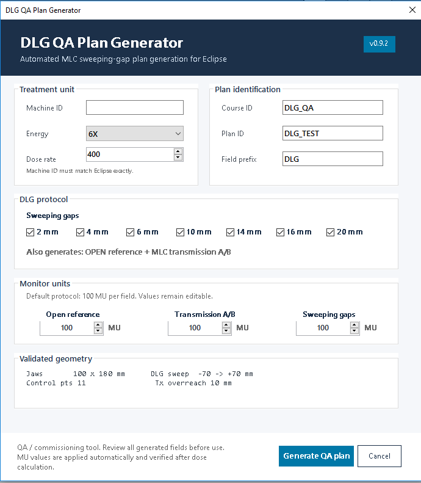
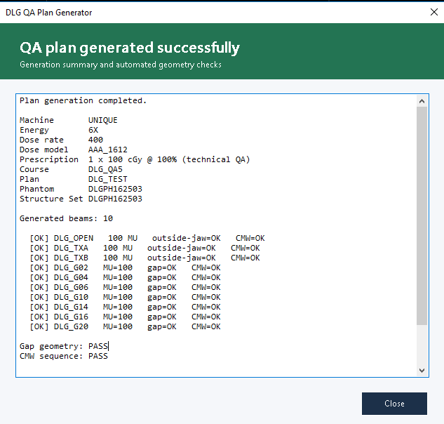

# DLG QA Plan Generator

ESAPI plugin that builds a complete Dosimetric Leaf Gap (DLG) and MLC transmission QA plan in Varian Eclipse.


## Overview

With a QA patient open in Eclipse, a single run creates:

- a synthetic water phantom and structure set;
- a QA course and external beam plan;
- an OPEN reference field;
- two MLC transmission fields (TX A and TX B);
- the sweeping-gap fields selected by the user (2 to 20 mm).

Monitor units are assigned with `CalculateDoseWithPresetValues()` and read back from Eclipse. Inputs, geometry and leaf speed are checked **before** anything is created, and the generated beams are checked again afterwards.

The plan can be measured with an EPID or an ion chamber. Analysis of the measured data is not included yet (see [Roadmap](#roadmap)).

## Tested configurations

| Eclipse | Treatment unit | Energy | Dose rate  | Dose model | Status    |
|---------|----------------|--------|------------|------------|-----------|
| 16.1    | Varian UNIQUE  | 6X     | 400 MU/min | AAA_1612   | Validated |

10X, 15X, 6X FFF and 10X FFF are implemented but not yet validated. If you run the plugin on another configuration, please report it in an issue so it can be added to this table.

## Field set

Beam IDs use the field prefix chosen in the interface (default `DLG`).

| Beam       | MLC during the beam                                                                 | Purpose               |
|------------|-------------------------------------------------------------------------------------|-----------------------|
| `DLG_OPEN` | Leaves open 10 mm beyond each X jaw (±60 mm)                                        | Open-field reference  |
| `DLG_TXA`  | 1 mm leaf gap parked 10 mm beyond the X2 jaw; the aperture is covered by the leaves coming from the X1 side | MLC transmission |
| `DLG_TXB`  | Mirror of TX A: gap 10 mm beyond the X1 jaw; the aperture is covered by the leaves coming from the X2 side | MLC transmission |
| `DLG_G02` … `DLG_G20` | Gap of 2, 4, 6, 10, 14, 16 or 20 mm sweeping across the field            | DLG                   |

Common geometry:

| Parameter              | Value                                                        |
|------------------------|--------------------------------------------------------------|
| Jaws                   | X −50 / +50 mm, Y −90 / +90 mm (100 × 180 mm)                |
| Gantry / collimator / couch | 0° / 0° / 0°                                            |
| Isocenter              | Center of the phantom                                        |
| Gap sweep              | Gap center from −70 to +70 mm (140 mm), 11 control points, linear in MU |
| OPEN / TX hidden sweep | 2 mm, entirely behind the X jaws                             |
| Phantom                | 400 × 400 mm, 81 planes at 2.5 mm, BODY assigned 0 HU        |
| Prescription           | 1 × 100 cGy (technical, required for the preset-MU calculation) |
| Default MU             | 100 per field (editable)                                     |


## How it works

Eclipse validates a Sliding Window beam only if the leaves move between control points. The sweeping-gap fields satisfy this naturally.

OPEN and TX are also created as Sliding Window beams. Their leaves move 2 mm, always behind the X jaws, so the exposed aperture is identical for the whole beam and Eclipse still accepts the leaf motion.

MU values are applied through `CalculateDoseWithPresetValues()`, which requires a photon dose model and a prescription. The plugin sets a technical prescription (1 × 100 cGy); it has no clinical meaning.

## Checks before generation

Nothing is created in the patient until these checks pass:

- **Inputs**: Machine ID present, Course and Plan IDs up to 16 characters, field prefix up to 10 characters, MU values above zero, at least one gap selected.
- **Geometry constants**: the gap starts and ends fully behind the jaws for the largest selected gap, OPEN and TX leaf tips never enter the aperture, and X1 < X2, Y1 < Y2. This protects users who edit the constants in the source.
- **Leaf speed**: see below.

### Leaf speed

Every leaf of a sweeping-gap field travels 140 mm, whatever the gap width. The time available for that travel depends on MU and dose rate:

```
time  = MU / (dose rate / 60)
speed = 140 mm / time
```

If the speed exceeds `MAX_LEAF_SPEED_MM_S` (default 25 mm/s), the plugin stops and reports the minimum MU. Minimum MU for the sweeping-gap fields at 25 mm/s:

| Dose rate (MU/min) | Leaf speed with 100 MU | Minimum MU |
|--------------------|------------------------|------------|
| 400                | 9.3 mm/s               | 38         |
| 600                | 14.0 mm/s              | 56         |
| 1400               | 32.7 mm/s              | 131        |
| 2400               | 56.0 mm/s              | 224        |

OPEN and TX fields are checked the same way for their 2 mm hidden sweep. Check the maximum leaf speed configured for your MLC and adjust the constant if needed.

## Checks after generation

The summary window verifies the beams as stored by Eclipse:

- **Gap width**: matches the requested value at every control point (±0.01 mm, central leaf pair).
- **OPEN / TX geometry**: leaf tips outside the jaw aperture at every control point (central leaf pair).
- **Control points**: 11 control points, meterset weights from 0 to 1, monotonically increasing.
- **MU**: `beam.Meterset.Value` matches the requested MU (±0.01 MU).

The overall status is PASS only if every field passes. Any CHECK must be reviewed before the plan is used.

## Screenshots

Configuration form:



Generation summary:



## Requirements

- Varian Eclipse 16.1 (validated). The build script also locates ESAPI 15.6 to 18.0, but those versions are untested.
- .NET Framework 4.x with `csc.exe` (4.8 recommended). No Visual Studio needed.
- Windows 10 / 11 (x64).
- A QA patient that ESAPI is allowed to modify.

## Build and installation

1. Clone the repository or download it as ZIP:

   ```
   git clone https://github.com/lucasbritocFis/esapi-dlg-qa-generator.git
   ```

2. Double-click `src\build.bat`. It can also be run from any folder in a command window.

3. The plugin is written to `bin\DLGGenerator_v<version>.esapi.dll` (for example `DLGGenerator_v0_9_2.esapi.dll`). The version is read from `APP_VERSION` in the source.

4. Copy the DLL to your Eclipse `PublishedScripts` folder.

5. Approve the script in Eclipse (Script Approvals) if your database requires approval for write-enabled scripts.

6. Restart Eclipse if an older build of the plugin was already loaded in the session.

### How build.bat finds ESAPI

The compiler is taken from `%WINDIR%\Microsoft.NET`. The ESAPI folder is searched in this order:

1. Environment variable `ESAPI_ROOT`.
2. File `esapi_path.txt` in the repository root, containing only the ESAPI API folder on the first line.
3. Common installation folders: `C:\` or `D:\`, `Program Files` or `Program Files (x86)`, `Varian\RTM\<version>\esapi\API`, versions 18.0 down to 15.6.

The script prints which source was used. If auto-detection fails or picks the wrong version, create `esapi_path.txt`:

```
C:\Program Files (x86)\Varian\RTM\16.1\esapi\API
```

or set the environment variable and open a new command window:

```
setx ESAPI_ROOT "C:\Program Files (x86)\Varian\RTM\16.1\esapi\API"
```

`esapi_path.txt` is listed in `.gitignore`, since it is specific to each computer.

## Usage

1. Open a QA patient in Eclipse. Do not use a clinical patient.
2. Run the plugin from the Scripts menu.
3. Enter the Machine ID exactly as the Treatment Unit ID in Eclipse, then choose energy, dose rate, MU and gaps.
4. Confirm the summary dialog.
5. Check that the generation summary shows PASS.
6. Review the plan and save the patient.
7. Deliver the plan in QA mode and measure each field.

If an error occurs after generation has started (for example, an invalid Machine ID), the plugin warns you. Close the patient **without saving** to discard the incomplete phantom, course and plan.

## Measurement and analysis notes

The plan comment records the energy, MU values, jaw size, sweep range and prescription, so the measurement conditions can be traced from the plan itself.

Automated analysis is not included yet. A common sweeping-gap analysis is:

1. Normalize every reading per MU.
2. Take the transmission `T` as the mean of TX A and TX B.
3. Correct each gap reading for the time the point spends under the leaves: `R_corr(g) = R(g) − T · (1 − g / L)`, with `L = 140 mm` for this plan.
4. Fit a straight line to `R_corr` versus gap width `g`. The DLG is the magnitude of the gap-axis intercept.

**EPID measurements**: the EPID response differs from an ion chamber, especially for the low-energy scatter that dominates transmission readings. DLG and transmission obtained with the EPID are suited to constancy and trend monitoring; they do not replace the chamber values used to commission the dose model.

## Configuration

Editable constants in `src/DLGGenerator.cs`:

- `DEFAULT_MU_OPEN`, `DEFAULT_MU_TX`, `DEFAULT_MU_DLG`: default MU values
- `X1`, `X2`, `Y1`, `Y2`: jaw positions
- `OPEN_MLC_PADDING_MM`, `TX_OVERREACH_MM`, `TX_STRIP_WIDTH_MM`: reference field geometry
- `REFERENCE_HIDDEN_SWEEP_MM`: hidden sweep of OPEN / TX
- `SWEEP_START`, `SWEEP_END`, `N_STEPS`: sweeping-gap parameters
- `AVAILABLE_GAPS`: selectable gap widths
- `MAX_LEAF_SPEED_MM_S`: leaf speed limit

Inconsistent geometry is rejected before generation. Some descriptive texts (plan comment, interface labels, summary) still show the default geometry and do not follow edited constants yet.

## Limitations

- Validated only on the configuration listed in [Tested configurations](#tested-configurations).
- Halcyon and Ethos are not supported (no X/Y jaws, different MLC design).
- Photons only.
- No analysis of measured data.
- Post-generation geometry checks use the central leaf pair.
- ESAPI 16.1 does not allow the Machine ID to be verified before generation. An invalid ID fails after the phantom and course are created (close without saving).
- Descriptive texts reflect the default geometry only.
- The phantom ID is based on the time of day (`DLGPH` + `HHmmss`).

## Repository structure

```
src/
  DLGGenerator.cs     plugin source (single file)
  build.bat           portable build script
docs/
  diagram.py          field geometry diagram
  animate.py          sweeping-gap animation
  img/                images used in this README
CHANGELOG.md
LICENSE
```

## Regenerating assets

- `docs/diagram.py` → `docs/img/diagram.png`
- `docs/animate.py` → `docs/img/dlg-sweep.gif`

Both run in Google Colab without local installation.

## Roadmap

- **v0.9.x**: derive descriptive texts from the geometry constants; check every leaf pair inside the Y jaws; dose-rate suggestion compatible with the leaf speed limit for FFF; unit tests for the geometry functions; XML documentation
- **v1.0.0**: external configuration, structured logging
- **v1.1.0**: multi-machine profiles
- **v1.2.0**: automated DLG and transmission analysis from measured data
- **v2.0.0**: integration with a daily QA suite

## Contributing

Open an issue before large pull requests. Follow the existing style, add a validation for any new geometry, and test in a non-clinical environment first. Reports of tested configurations are welcome.

## Citation

Cavalcanti, L. B. (2026). DLG QA Plan Generator (Version 0.9.2). https://github.com/lucasbritocFis/esapi-dlg-qa-generator

## License

MIT License. See [LICENSE](LICENSE).

## Disclaimer

This software is provided as-is and is intended for use by qualified medical physicists on QA patients. All generated plans must be independently reviewed before delivery. Not affiliated with Varian Medical Systems.

## Author

Lucas de Brito Cavalcanti, Medical Physicist
GitHub: [@lucasbritocFis](https://github.com/lucasbritocFis)
